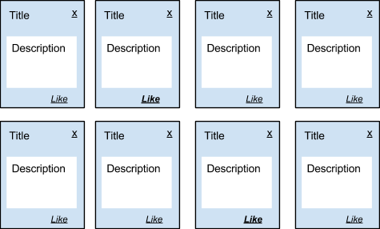

# spa-jquery-es6

## Description

This project is an single page application (SPA) written with the using such technologies as [npm](https://www.npmjs.com/) (Package manager), [jQuery](https://jquery.com/) (Library for js), javascript (modern standart [ES6](http://es6-features.org/)), [express](http://expressjs.com/) (framework for nodejs server). It uses pattern MVC for architecture, JSON-file like store in the server and localStorage like local store.

## Task

To develop SPA with the following functionality:



- Displays a list of entities (see. picture above)
- This list will be loaded from the server in JSON format using the AJAX-request (you can create your own server, or use a cloud database with the REST API interface).
- Each entity must have at least the title, a short description and state of the Like (or likes counter).
- When you click on "X", corresponding card is removed from the page (using any jquery effect) and sent a request to delete the card from the server.
- Clicking on the "Like" - changing design of labels and sent a request to the server to make the appropriate changes.

## Installation

To get started, you have to install `nodejs` and `npm`. After, using `npm` to install global dependencies:
```bash
npm install -g babel browserify
```

Then navigate into the project folder (after fork/download/clone) and install the npm-modules.
```bash
cd jquery-training
npm install
```

## Compiling ES6 to ES5

After npm-modules have been installed, use [Babel](https://babeljs.io/) script to convert the `src` files. [Browserify](http://browserify.org/) is also used so that `module.exports` and `require()` can be run in your browser.

```bash
npm run compile
```

## Usage

To check this project, you can start nodejs server and then open your browser and go to: `http://localhost:8089/`:

```bash
node server/server.js 
```


